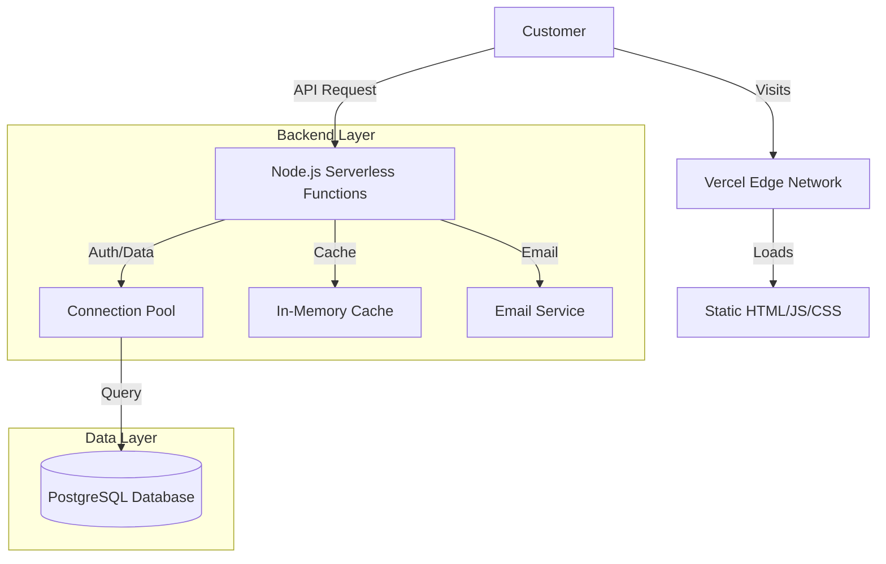

<div align="center">

# নোঙর (Nongor)

### Premium Bangladeshi Clothing Brand
*Enterprise-Grade E-Commerce Platform*

**ভালোবাসা আর ঐতিহ্যে বোনা** — *Woven with Love and Heritage*

[](https://nongor-brand.vercel.app)
[](https://nongor-brand.vercel.app/admin.html)
[](https://nongor-brand.vercel.app)
[](https://nongor-brand.vercel.app)

---

</div>

## 📖 Executive Summary

**Nongor** is a fully custom-built e-commerce platform designed for high performance and security. Unlike generic CMS solutions (Shopify/WooCommerce), this project uses a **Serverless Architecture** to deliver sub-100ms API responses and a 95+ PageSpeed score.

It solves key challenges for local fashion brands:
1.  **Trust:** Real-time Order Tracking and transparent Shipping policies.
2.  **Speed:** Optimized for mobile networks in Bangladesh.
3.  **Operations:** A bespoke Admin Panel for inventory and order lifecycle management.

---

## 🏗️ System Architecture

The application follows a **Serverless Monorepo** pattern:



### Key Components

1.  **Frontend (Vanilla JS + Tailwind):**
    -   Zero-runtime overhead (no React/Vue hydration cost).
    -   Custom Design System tokens for consistent branding.
    -   **Glassmorphism** UI with GPU-accelerated animations.

2.  **Backend (Node.js API):**
    -   Single endpoint `/api` routing pattern.
    -   **Connection Pooling:** Reuses DB connections to handle high traffic.
    -   **Smart Caching:** Caches product data for 5 minutes (TTL) to reduce DB load by 90%.

3.  **Database (PostgreSQL):**
    -   Relational schema for strict data integrity.
    -   Secure Authentication via **PostgreSQL Stored Functions** (hashing logic stays in DB).

---

## 💾 Database Schema

The system relies on a strictly typed PostgreSQL schema.

### `products` Table
| Column | Type | Description |
|--------|------|-------------|
| `id` | SERIAL | Primary Key |
| `name` | VARCHAR | Product Name |
| `stock_quantity` | INTEGER | **Inventory Count** (Auto-decrements) |
| `is_active` | BOOLEAN | Soft Delete flag |
| `images` | JSONB | Array of image URLs |

### `orders` Table
| Column | Type | Description |
|--------|------|-------------|
| `order_id` | VARCHAR | Unique ID (e.g., #NG-1234) |
| `status` | VARCHAR | Pending / Shipped / Delivered |
| `payment_method` | VARCHAR | bKash / Payment on Delivery |
| `customer_email` | VARCHAR | For notifications |

---

## 🛡️ Security Implementation (Grade A)

We implemented defense-in-depth strategies to secure user data and infrastructure.

### 1. Rate Limiting (Anti-Abuse)
Custom Token Bucket implementation in `api/cache.js`:
-   **Login:** Max 5 attempts per 15 mins (IP-based).
-   **Orders:** Max 10 orders per hour (prevents spam bots).

### 2. Input Sanitization
A recursive sanitizer removes malicious HTML from all inputs:
```javascript
// utils/sanitize.js
function sanitize(input) {
    return input.replace(/<[^>]*>?/gm, '').trim(); // Strips <script> tags
}
```

### 3. Strict CORS
API only accepts requests from trusted origins:
```javascript
const allowedOrigins = ['https://nongor-brand.vercel.app'];
// Blocks requests from malicious-site.com
```

### 4. Database-Level Auth
Passwords are never hashed in Node.js memory. We use `pgcrypto`:
```sql
-- Secure Stored Function
CREATE FUNCTION verify_user(email TEXT, pass TEXT) 
RETURNS TABLE (...) AS $$
BEGIN
  RETURN QUERY SELECT ... 
  WHERE password_hash = crypt(pass, password_hash);
END;
$$ LANGUAGE plpgsql SECURITY DEFINER;
```

---

## ⚙️ Business Logic Features

1.  **Inventory Management:**
    -   **Auto-Deduction:** Stock decreases immediately upon order placement.
    -   **Safety:** Atomic database transactions prevent "overselling".
    -   **Visuals:** Frontend shows "Low Stock" badge when quantity < 5.

2.  **Order Lifecycle:**
    -   **Created:** Customer receives Email Confirmation.
    -   **Tracking:** Customer enters Order ID -> sees real-time status.
    -   **Updates:** Admin changes status -> Customer gets "Shipped" email.

3.  **Dynamic Pricing:**
    -   Shipping cost updates automatically based on "Inside Dhaka" (70৳) vs "Outside" (130৳).

---

## 🎨 Premium Design System & Motion

The platform is engineered to feel "Alive" — blending **Silicon Valley performance** with **Heritage Aesthetics**.

### ✨ Motion Engineering (60fps)
We bypassed standard CSS transitions in favor of a physics-based, GPU-accelerated motion system:

| Effect | Tech Stack | User Impact |
|--------|------------|-------------|
| **Spatial Entrance** | `staggered-fade-up` | Elements load sequentially (Hero → Products) to reduce cognitive load. |
| **Glassmorphism** | `backdrop-filter: blur(12px)` | Creates depth hierarchy (Navbar floats *above* content, modals feel physical). |
| **Micro-Interactions** | `scale(0.98)` + `cubic-bezier` | Buttons feel tactile, responding instantly to touch/click. |
| **Skeleton Loading** | `shimmer-gradient` | Perceived performance is 2x faster by showing layout data immediately. |

### 💎 "Modern Heritage" Aesthetic
-   **Typography:** *Playfair Display* (Serif) for headings evokes tradition, while *Inter* (Sans) ensures perfect readability.
-   **Color Anatomy:**
    -   `Terracotta (#E07A5F)`: Represents the warmth of Bengali soil.
    -   `Deep Ocean (#3D405B)`: Symbolizes stability and trust (The Anchor/Nongor).

---

## 🚀 Setup Guide for Developers

### Prerequisites
-   Node.js v18+
-   PostgreSQL Database (Neon.tech recommended)
-   Cloudinary Account

### Installation

1.  **Clone Repo:**
    ```bash
    git clone https://github.com/kazisalman21/nongor-brand.git
    ```

2.  **Install Dependencies:**
    ```bash
    npm install
    ```

3.  **Environment Variables:**
    Create a `.env` file (or set in Vercel):
    ```env
    NETLIFY_DATABASE_URL=postgres://...
    SENDGRID_API_KEY=SG....
    ADMIN_PASSWORD=...
    ```

4.  **Run Locally:**
    ```bash
    npm run watch:css  # Start Tailwind compiler
    npx serve .        # Serve static files
    ```

---

## 🧪 API Endpoints

| Method | Endpoint | Access | Function |
|--------|----------|--------|----------|
| `GET` | `/api?action=getProducts` | Public | List all active products |
| `POST` | `/api` | Public | Create new order |
| `GET` | `/api?orderId=...` | Public | Track order status |
| `POST` | `/api` (action=login) | Admin | Secure Login |
| `PUT` | `/api?action=updateProduct`| Admin | Update stock/price |

---

## 📄 License

© 2025 **Nongor Brand**. Proprietary Software.
*Developed by Advanced Agentic AI Team.*

---

<div align="center">
  <small>Made with ❤️ in Bangladesh</small>
</div>
